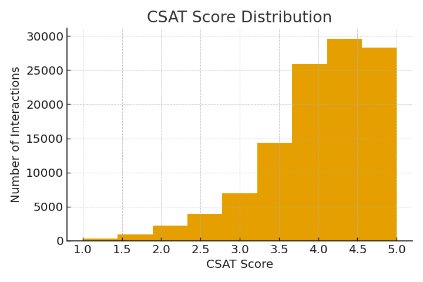
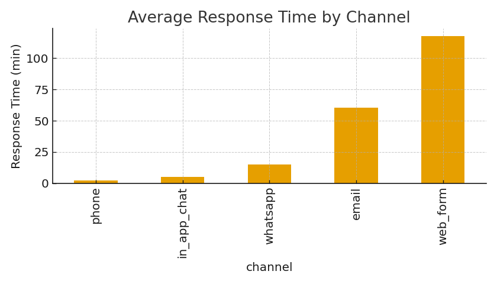
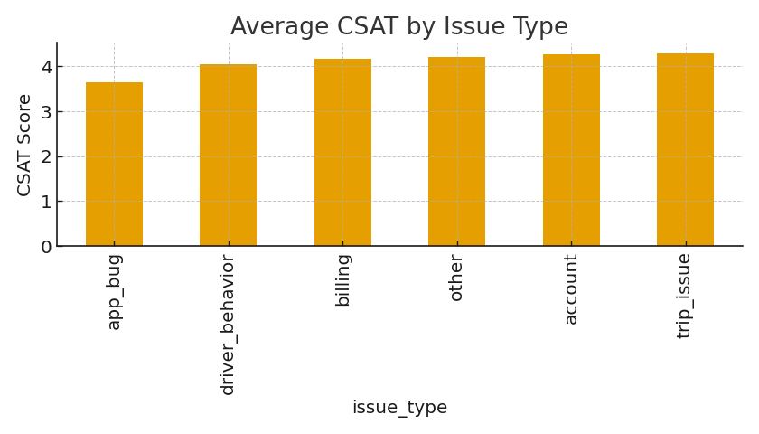
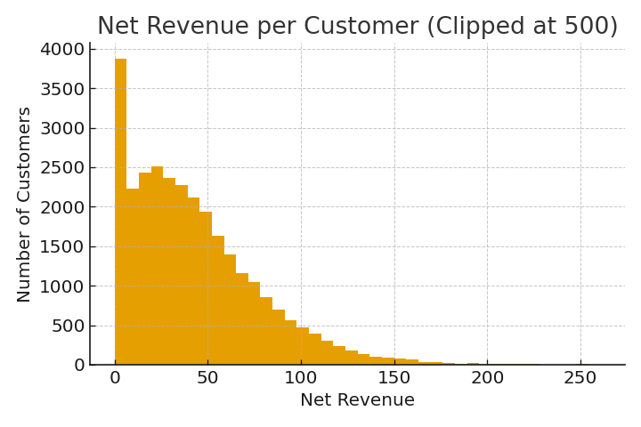
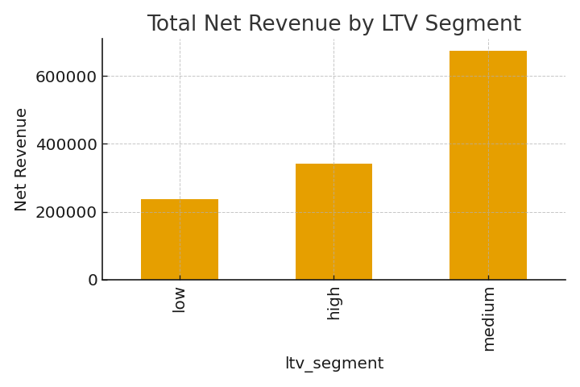
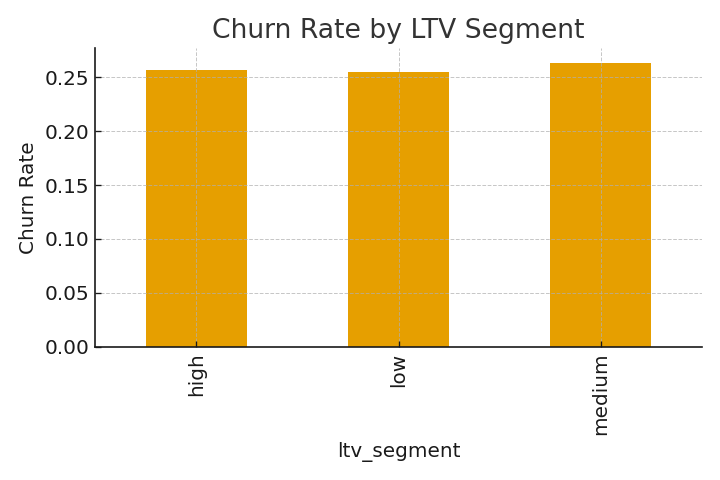

# Service Quality & Customer LTV Analytics – Urban Mobility Platform 🚕⭐

**Author:** Luis Chaumer  
**Role:** Data Analyst  
**Dataset:** 112,568 interactions · 30,000 customers  
**Tools:** Python, Pandas, Matplotlib, SQLite (SQL), Jupyter Notebook  

---

## 📘 Project Overview

This project analyzes **Service Quality**, **Customer Satisfaction**, and **Customer Lifetime Value (LTV)**  
for a fictional ride-hailing / mobility platform.

Using a **unified dataset of support interactions + trip data**, we evaluate:

### **Part 1 — Service Quality & Customer Satisfaction**
- Response & resolution times  
- CSAT and NPS behavior  
- Escalations, reopened & unresolved cases  
- Performance by channel and issue type  

### **Part 2 — Customer Segmentation & LTV**
- Net revenue and trip behavior  
- LTV segmentation (Low / Medium / High)  
- Satisfaction segments (Promoter / Neutral / Detractor)  
- Churn vs. LTV vs. satisfaction  
- SQL-driven relationship analysis  

This dataset simulates **112,568 interactions** for **30,000 customers** across 5 regions and 8 countries.

---

## 📂 Dataset Description

### **Interactions dataset (`service_quality_interactions_dataset.csv`)**

| Column | Description |
|--------|-------------|
| interaction_id | Unique interaction identifier |
| customer_id | Customer performing the interaction |
| interaction_datetime | Timestamp |
| region | Region where service issue occurs |
| channel | in_app_chat / phone / email / whatsapp / web_form |
| issue_type | billing / trip_issue / app_bug / account / driver_behavior / other |
| response_time_min | Time until first response |
| resolution_time_min | Time until issue resolved |
| resolution_status | first contact / late / escalated / unresolved |
| csat_score | Customer satisfaction (1–5, half stars) |
| nps_score | Net promoter score (0–10) |
| has_trip | Whether interaction is linked to a trip |
| trip_value | Monetary value of the associated trip |
| refund_amount | Refund amount |
| reopened | Whether ticket was reopened |
| customer_is_churned | Link to churn behavior |

---

### **Customer-level dataset (`service_quality_customers_agg_dataset.csv`)**

Aggregated metrics per customer:

- Interactions  
- Trips & revenue  
- Refunds, net revenue  
- Tenure & recency  
- Contacts per month  
- LTV segment: **low / medium / high**  
- Satisfaction segment: **promoter / neutral / detractor**  
- Churn indicator  

---

## 📊 Key Visualizations

### ⭐ CSAT Distribution

### ⚡ Response Time by Channel

### 🛠️ CSAT by Issue Type

### 💰 Net Revenue Distribution (customer-level)

### 🧱 Revenue Contribution by LTV Segment

### ❌ Churn Rate by LTV Segment

---

## 🧮 Main KPIs (Python)

kpis = {
    "avg_response_time": interactions["response_time_min"].mean(),
    "median_response_time": interactions["response_time_min"].median(),
    "avg_resolution_time": interactions["resolution_time_min"].mean(),
    "csat_mean": interactions["csat_score"].mean(),
    "nps_mean": interactions["nps_score"].mean(),
    "fcr_rate": (interactions["resolution_status"]=="resolved_first_contact").mean(),
    "escalation_rate": (interactions["resolution_status"]=="escalated").mean(),
    "unresolved_rate": (interactions["resolution_status"]=="unresolved").mean(),
    "reopened_rate": interactions["reopened"].mean(),
}
🗄 SQL Analysis (SQLite)
🔹 Average CSAT & response time by region
sql
Copiar código
SELECT 
    region,
    COUNT(*) AS interactions,
    ROUND(AVG(csat_score), 2) AS avg_csat,
    ROUND(AVG(response_time_min), 2) AS avg_response_time
FROM interactions
GROUP BY region
ORDER BY avg_csat DESC;
🔹 Churn by LTV and satisfaction cluster
sql
Copiar código
SELECT 
    ltv_segment,
    satisfaction_segment,
    COUNT(*) AS customers,
    ROUND(AVG(is_churned), 3) AS churn_rate,
    ROUND(AVG(net_revenue), 2) AS avg_net_revenue
FROM customers
GROUP BY ltv_segment, satisfaction_segment
ORDER BY ltv_segment, satisfaction_segment;
🧩 Insights & Interpretation
Service Quality Findings
Phone and in-app chat are the fastest channels → highest CSAT.

App bugs and driver behavior cases yield the lowest satisfaction.

A significant share of negative CSAT correlates with:

Long response times (>30 min)

Resolution delays (>240 min)

Escalated cases

Customer & LTV Findings
High LTV customers contribute the largest share of total net revenue.

Low satisfaction (detractors) strongly correlates with churn.

Customers with reopened or unresolved cases have 2–3× higher churn probability.

🎯 Business Recommendations
Improve Service Quality
Prioritize response & resolution SLAs for high-friction issue types.

Enhance phone & chat routing for high-value customers.

Deploy alerts for repeated reopened cases.

Strengthen Revenue & LTV
Personalized retention strategies for medium-LTV customers (upsell opportunity).

Loyalty / credits program for high-LTV customers.

Churn prediction model integrating:

Interaction friction

Satisfaction segment

Net revenue

Recency

🧰 Tech Stack
Python: pandas, numpy, matplotlib

SQL: SQLite

Jupyter Notebook

Segmentation: LTV buckets, satisfaction clusters

Metrics: CSAT, NPS, FCR, churn, recency, tenure

📁 Repository Structure
kotlin
Copiar código
service-quality-ltv/
├── data/
│   ├── service_quality_interactions_dataset.csv
│   └── service_quality_customers_agg_dataset.csv
├── images/
│   ├── csat_distribution.png
│   ├── response_time_by_channel.png
│   ├── csat_by_issue_type.png
│   ├── net_revenue_distribution.png
│   ├── revenue_by_ltv_segment.png
│   └── churn_by_ltv_segment.png
├── service_quality_ltv_analysis.ipynb
└── README.md
📬 Contact
Luis Chaumer – Data Analyst
📩 Email: luischaumer@gmail.com
🔗 LinkedIn: www.linkedin.com/in/luis-chaumer123
